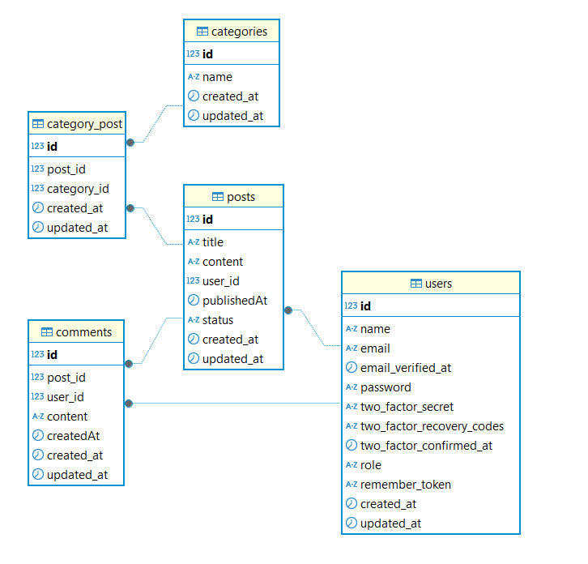

# Blog App

### Chnages

- add database relations
- Add header UI
- add blog Grid
- Add Blog catagory bar
- Add Blog view Page

### rough skatch for use case Diagram

usecaseDiagram
    actor User
    actor Admin

    User --> (View blog posts)
    User --> (Comment on blog posts)
    User --> (Edit their own comments)

    Admin --> (Manage users )
    Admin --> (Manage blog posts )
    Admin --> (Manage comments )
    Admin --> (View dashboard with analytics and statistics)

    Author --> (Create new blog posts)
    Author --> (Edit their own blog posts)
    Author --> (Publish their own blog posts )
    Author --> (View their own blog post analytics)

### Database Diagram (screenshot of DBMS tool database diagram)

